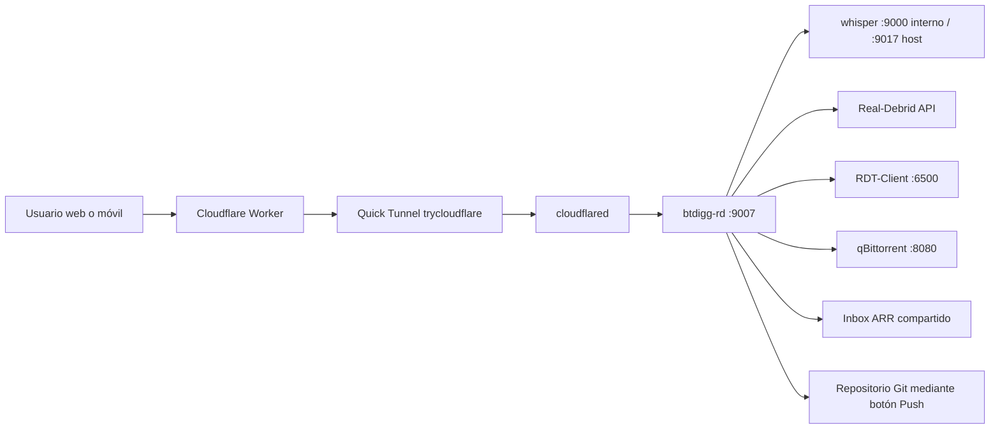

# Auditoría para la duplicación limpia de Buscador RD

Fecha de auditoría: 2026-07-11

Proyecto original: `Z:\buscador-rd` / `/volume1/docker/buscador-rd`

Destino previsto: `Z:\buscador pro` / `/volume1/docker/buscador pro`

Estado del destino: existe y está vacío

Alcance: lectura del original y creación exclusiva de este informe

## 1. Veredicto

La duplicación es viable, pero no se puede levantar una copia literal del árbol actual. Hay cuatro bloqueos directos: el nombre Compose fijo `buscador-rd`, los tres `container_name` fijos, los puertos publicados `9007` y `9017`, y la identidad Cloudflare compartida. Además, una copia literal conservaría acceso al repositorio Git original, a la misma cuenta Real-Debrid, a los mismos receptores RDT/qBittorrent y al mismo inbox ARR.

La copia debe construirse desde código y configuración saneada, con runtime nuevo. No deben copiarse `.git`, `_backups`, `_codex_runtime`, `.playwright-mcp`, diagnósticos históricos, modelos/logs ni credenciales. El puerto `9117` propuesto en el plan rector no está libre: actualmente lo publica `gluetun`. En esta auditoría se comprobaron libres `9107` y `9127`, por lo que la pareja válida hoy es `9107:9007` para la web y `9127:9000` para Whisper.

## 2. Fuentes revisadas

Se revisaron primero los archivos raíz pedidos:

| Archivo | Estado | Uso en la auditoría |
|---|---:|---|
| `AGENTS.md` | Existe | Raíz real, piezas del stack, runtime y reglas de seguridad |
| `README.md` | Existe | Identidad y documentación pública |
| `pyproject.toml` | No existe | No aplica |
| `package.json` | No existe | No aplica |
| `docker-compose.yml` | No existe | No aplica |
| `docker-compose.yaml` | Existe | Compose real y local; contiene configuración sensible |
| `compose.yml` | No existe | No aplica |
| `compose.yaml` | No existe | No aplica |
| `.env` | No existe | El Compose real lleva valores locales y dos `env_file` de Cloudflared |
| `.gitignore` | Existe | Límites entre código, runtime, secretos y artefactos |

También se revisaron `docker-compose.example.yaml`, `.env.example`, Dockerfiles, arranques, rutas Flask, configuración de Cloudflared, watcher/worker, scripts, CI, hook Git, pruebas y referencias absolutas a las raíces Windows/NAS.

## 3. Mapa del stack actual

### 3.1 Compose y recursos

| Elemento | Valor actual | Observación |
|---|---|---|
| Archivo Compose real | `Z:\buscador-rd\docker-compose.yaml` | Ignorado por Git porque contiene configuración local |
| Project name | `buscador-rd` | Fijo mediante `name:`; una copia literal pertenecería al mismo proyecto Compose |
| Servicios | `btdigg-rd`, `cloudflared`, `whisper` | Confirmados por `docker compose config --services` |
| Red | `default` | No hay red explícita; Compose crea una red por project name |
| Volúmenes nombrados | Ninguno | Todos los mounts son bind mounts |
| Estado real | Tres servicios `Up` | Web 21 h; Cloudflared y Whisper 38 h en la comprobación |

### 3.2 Servicios y arranque

| Servicio | Imagen/Build | Arranque | Nombre fijo | Puerto host |
|---|---|---|---|---|
| `btdigg-rd` | Build `services/btdigg-rd` | `python /app/app/app.py` | `btdigg-rd` | `9007:9007` |
| `whisper` | `hwdsl2/whisper-server:latest` | `/opt/src/run.sh` de la imagen | `whisper` | `9017:9000` |
| `cloudflared` | Build `services/cloudflared` | `python /app/supervisor.py` | `cloudflared` | Sin puerto publicado |

`services/cloudflared/supervisor.py` lanza dos procesos dentro del mismo contenedor: el quick tunnel de `cloudflared` y `watcher.py`. El watcher detecta la URL `*.trycloudflare.com`, despliega/actualiza un Worker, escribe la URL en KV y conserva estado/enlace en bind mounts persistentes.

### 3.3 Bind mounts

| Servicio | Host actual | Contenedor | Tipo | Política para la copia |
|---|---|---|---|---|
| Whisper | `./config/whisper/data` | `/var/lib/whisper` | RW | Crear runtime propio; no copiar 3,54 GB de datos/modelos por defecto |
| Whisper | `./config/whisper/logs` | `/app/logs` | RW | Crear vacío |
| Web | `./config/btdigg-rd/data` | `/app/data` | RW | Crear vacío y sembrar solo configuración necesaria, nunca historial/tokens crudos |
| Web | `./diagnostics_public` | `/app/diagnostics_public` | RW | Crear limpio, sin las 3.177 evidencias históricas actuales |
| Web | `./` | `/app/project` | RW | En la copia apuntará al nuevo árbol; desactivar Push hasta tener repo propio |
| Web | `./config/btdigg-rd/git/publish_ed25519` | `/app/git_key/publish_ed25519` | RO | No copiar la clave original |
| Web | Cloudflared data/logs y Whisper logs | `/app/public_sources/...` | RO | Apuntar solo a runtime nuevo de la copia |
| Web | `/volume1/UGREEN/data/torrents/watch/inbox` | `/watch/torrents/inbox` | RW | Recurso externo compartido; no es aislamiento real |
| Cloudflared | `./config/cloudflared/logs` | `/app/logs` | RW | Crear vacío |
| Cloudflared | `./config/cloudflared/data` | `/app/data` | RW | Crear vacío y con identidad nueva |
| Cloudflared | `./services/cloudflared/worker` | `/app/worker` | RO | Copiar código; desplegar con nombre/KV distintos |

### 3.4 Dependencias y dominios

| Área | Destino actual |
|---|---|
| Web local | `http://192.168.1.159:9007` |
| Whisper local | `http://192.168.1.159:9017` |
| Whisper interno | `http://whisper:9000/v1` |
| Real-Debrid | `https://api.real-debrid.com/rest/1.0` |
| RDT-Client | `http://192.168.1.159:6500` |
| qBittorrent | `http://192.168.1.159:8080` |
| BTDigg | `https://en.btdig.com` / `https://btdig.com` |
| TMDB | `https://api.themoviedb.org/3` |
| Cloudflare API | `https://api.cloudflare.com/client/v4` |
| Quick tunnel | URL dinámica `https://<id>.trycloudflare.com` |
| Worker público actual | `https://cloudflared.lacabraesmia-cloudflared.workers.dev` |
| Git remoto | `https://github.com/jodiazhidalgo-collab/buscador-rd.git` |

La réplica puede compartir BTDigg y TMDB sin conflicto de identidad, pero compartir RD, RDT, qB y el inbox ARR significa que sus pruebas pueden crear, reutilizar o borrar estado de los mismos sistemas reales.

## 4. Endpoints web detectados

La aplicación Flask publica `/` y `/favicon.ico`. El blueprint principal añade:

| Grupo | Endpoints |
|---|---|
| Jobs | `POST /api/job`, `GET /api/job/active`, `GET /api/job/<job_id>`, `POST /api/job/<job_id>/cancel`, `GET /api/job/<job_id>/stream` |
| Seguimiento RD | `GET /api/job/<job_id>/rd-follow` |
| Cola | `GET/POST /api/search-queue`, `POST /api/search-queue/stop`, `POST /api/search-queue/clear` |
| Pruebas RD | `POST /api/rd-test/job`, `GET /api/rd-test/job/active`, `GET /api/rd-test/job/<run_id>`, `GET /api/rd-test/job/<run_id>/follow`, `GET /api/rd-test/job/<run_id>/event/<event_id>`, `GET /api/rd-test/runs`, `POST /api/rd-test/cleanup`, `POST /api/rd-test/job/<run_id>/export` |
| Resultados e historial | `GET /api/results/btdigg`, `GET /api/results/<module>`, `GET /api/history/btdigg`, `GET /api/history/qbit-no-seeds` |
| Descarga | `POST /api/rdt/send` |
| Persistencia UI | `GET/POST /api/ui-state` |
| Voz y títulos | `POST /api/voice/diagnostic`, `POST /api/voice/transcribe`, `POST /api/title-resolver/resolve`, `POST /api/spoken-title-resolver/resolve` |
| Configuración | `GET/POST /api/qbit-toggle`, `GET/POST /api/tv-rules`, `POST /api/tv-rules/reset`, `POST /api/tv-rules/classify`, `GET/POST /api/settings` |
| Publicación | `POST /api/project/push` |

## 5. Conflictos que impiden ejecutar dos copias en paralelo

| Prioridad | Archivo | Problema exacto | Efecto | Acción exacta en la copia |
|---:|---|---|---|---|
| Crítica | `docker-compose.yaml:1` | `name: buscador-rd` | La copia sería el mismo proyecto Compose | Cambiar a `name: buscador-pro` y operar siempre con project name `buscador-pro` |
| Crítica | `docker-compose.yaml:6` | `container_name: whisper` | El nombre global ya existe | Cambiar a `whisper-pro` |
| Crítica | `docker-compose.yaml:28` | `container_name: btdigg-rd` | El nombre global ya existe | Cambiar a `btdigg-rd-pro` |
| Crítica | `docker-compose.yaml:84` | `container_name: cloudflared` | El nombre global ya existe | Cambiar a `cloudflared-pro` |
| Crítica | `docker-compose.yaml:9` | `9017:9000` | El host `9017` ya está ocupado | Publicar `9127:9000`; `9117` está ocupado por `gluetun` |
| Crítica | `docker-compose.yaml:34` | `9007:9007` | El host `9007` ya está ocupado | Publicar `9107:9007` |
| Crítica externa | `config/cloudflared/config/public.env` | `WORKER_NAME=cloudflared`, KV `cloudflared_tunnel_state` | Dos watchers actualizarían el mismo Worker/KV | Usar `WORKER_NAME=cloudflared-pro` y `KV_NAMESPACE_TITLE=cloudflared_tunnel_state_pro` |
| Crítica externa | `docker-compose.yaml` y `config/cloudflared/config/secrets.env` | Mismas credenciales/llave de entrada | Riesgo de sobrescribir exposición pública o compartir acceso | Crear ficheros propios; no copiar el secreto original a ciegas |
| Alta | `docker-compose.yaml:91` | `TUNNEL_TARGET=http://192.168.1.159:9007` | La nube de la copia apuntaría a la web original | Usar `http://btdigg-rd:9007` dentro de la red Compose de la copia |
| Alta | `docker-compose.yaml` | Push habilitado, remoto y deploy key del original | El botón Push de la copia publicaría en el repo original | Iniciar con `BTDIGG_PROJECT_PUSH_ENABLED=0`, sin clave y sin remoto; habilitar solo con repo propio |

## 6. Riesgos que no bloquean el arranque pero mezclan operaciones

| Archivo/área | Riesgo | Acción previa al primer uso real |
|---|---|---|
| `REAL_DEBRID_TOKEN` y runtime RD | Las dos webs consumen la misma cuenta, slots, límites y temporales | Decidir conscientemente si se comparte; las pruebas de humo no deben crear torrents |
| `RDT_BASE` | Ambas instancias ven y modifican la misma cola RDT | Mantener descargas desactivadas durante el smoke o usar receptor dedicado |
| `QBIT_BASE` | Ambas instancias ven y modifican el mismo qBittorrent | No ejecutar probes/descargas hasta validar aislamiento operativo |
| Inbox ARR absoluto | Dos instancias escriben al mismo receptor de `.torrent` | Mantenerlo desmontado o sin usar durante la validación inicial |
| `config/btdigg-rd/data` | Copiarlo arrastra historial, jobs, configuración, tokens y caja negra | Crear directorio nuevo y vacío |
| `diagnostics_public` | Hay 3.177 archivos y unos 64 MB de evidencia histórica versionada | No llevarlos como estado inicial de la nueva aplicación |
| `.git` | El árbol local ocupa unos 23,21 GB y conserva historia/remotos del original | No copiar; iniciar Git limpio cuando corresponda |
| `_codex_runtime` | Unos 748 MB de entornos y artefactos temporales | No copiar |
| `config/whisper/data` | Unos 3,54 GB de datos/modelos | No copiar por defecto; dejar que la réplica cree su runtime propio |
| Skills y scripts originales | Contienen raíces, puertos y filtros del original | No ejecutarlos desde la copia hasta adaptarlos |

## 7. Sustituciones exactas necesarias

### 7.1 Sustituciones operativas

| Valor actual | Valor de copia | Alcance |
|---|---|---|
| `Z:\buscador-rd` | `Z:\buscador pro` | Documentación, AGENTS, skills y scripts de la copia |
| `/volume1/docker/buscador-rd` | `/volume1/docker/buscador pro` | Scripts remotos y documentación NAS |
| Project name `buscador-rd` | `buscador-pro` | Compose |
| Contenedor `btdigg-rd` | `btdigg-rd-pro` | Solo `container_name` y filtros Docker por nombre |
| Contenedor `whisper` | `whisper-pro` | Solo `container_name` |
| Contenedor `cloudflared` | `cloudflared-pro` | Solo `container_name` |
| Host `9007` | Host `9107` | Publicación, URL local, smoke tests y UI check |
| Host `9017` | Host `9127` | Publicación y comprobaciones externas de Whisper |
| Worker `cloudflared` | `cloudflared-pro` | Cloudflare Worker |
| KV `cloudflared_tunnel_state` | `cloudflared_tunnel_state_pro` | Cloudflare KV |
| Git remoto original | Ninguno inicialmente | Botón Push y configuración Git |

### 7.2 Valores que deben permanecer internos

No se debe hacer un reemplazo global de `9007`, `9017`, `btdigg-rd` o `whisper`:

| Valor | Motivo para conservarlo |
|---|---|
| `PORT=9007` | Puerto interno de Flask |
| `EXPOSE 9007` | Puerto interno de la imagen web |
| Destino `9007` en `9107:9007` | Puerto interno de la web |
| Destino `9000` en `9127:9000` | Puerto interno de Whisper |
| Servicio Compose `btdigg-rd` | DNS interno estable y aislado por la red del proyecto |
| Servicio Compose `whisper` | Permite conservar `http://whisper:9000/v1` sin tocar código |
| `http://btdigg-rd:9007` | Ruta interna correcta para Cloudflared |
| APIs externas de RD/BTDigg/TMDB | No son identidad de la copia |

### 7.3 Archivos que requieren adaptación dirigida

| Archivo | Problema | Acción exacta |
|---|---|---|
| `AGENTS.md` | Raíces, puertos, identidad y cierre apuntan al original | Crear AGENTS propio de la copia; no hacer reemplazo indiscriminado |
| `.agents/skills/rebuild-btdigg-rd/scripts/rebuild_and_check.ps1` | `cd` NAS, filtro de contenedor y URL `9007` fijos | Adaptar a raíz NAS nueva, `btdigg-rd-pro` y `9107` |
| `.agents/skills/playwright-ui-check-btdigg-rd/scripts/ui_check.ps1` | URL principal `9007` | Cambiar URL por defecto a `http://192.168.1.159:9107/` |
| `.agents/skills/backup-btdigg-rd/*` | Backup y status en raíz original | Crear variante de copia con `_backups` bajo `Z:\buscador pro` |
| `.agents/skills/cerrar-git-btdigg-rd/*` | Cierre contra repo original | No usar hasta que la copia tenga Git/remoto propios |
| `.agents/skills/replicate-btdigg-rd/*` | Describe réplicas 2/3 históricas | No trasladar como workflow activo de `buscador pro` |
| `.codex/agents/browser-debugger.toml` | URL `9007` | Crear agente nuevo con `9107` en la fase de gobierno |
| `services/btdigg-rd/tests/test_live_search_web.py` | Default `http://localhost:9007` | Ejecutar con `BTDIGG_LIVE_BASE_URL=http://localhost:9107`; evitar cambiar el puerto interno |
| `.github/workflows/ci.yml` | Nombres Buscador RD y artefactos antiguos | Ajustar branding cuando la copia tenga repo propio; no bloquea Compose |

## 8. Política de copia: incluir y excluir

### Incluir

- Código bajo `services/btdigg-rd` y `services/cloudflared`.
- `docker-compose.example.yaml` como contrato y un `docker-compose.yaml` nuevo adaptado.
- `.env.example`, `.gitignore`, `.gitattributes`, `pytest.ini`, tests y documentación funcional.
- Skills útiles únicamente después de adaptar raíces, identidad y puertos.
- Directorios vacíos necesarios para runtime, creados expresamente en el destino.

### Excluir

- `.git/` y cualquier remoto/hook activo heredado.
- `_backups/`, `_codex_runtime/`, `.playwright-mcp/` y capturas antiguas.
- `config/btdigg-rd/data/` y `config/btdigg-rd/git/`.
- `config/cloudflared/data/`, `logs/`, `public.env` y `secrets.env` reales.
- `config/whisper/data/` y `logs/`.
- `diagnostics_public/` histórico; la copia debe generarlo desde su propio runtime.
- ZIP, logs, cachés Python, `.pytest_cache`, `__pycache__` y ficheros temporales.

## 9. Archivos excesivamente grandes

Se contaron líneas con `Get-Content`. Superan el límite de 1.200:

| Líneas | Archivo | Candidato de corte |
|---:|---|---|
| 6.242 | `services/btdigg-rd/app/motor/btdigg/rd_turbo_pro.py` | Sí; motor BTDigg, scoring, RD, qB, exportación y utilidades aún conviven |
| 3.769 | `services/btdigg-rd/app/web/static/js/btdigg-rd.js` | Sí; estado UI, jobs, cola, voz, historial, settings y descarga |
| 1.322 | `services/btdigg-rd/app/api/btdigg_rd/send.py` | Sí; orquestación RDT/RD/qB pese a módulos auxiliares ya extraídos |

Archivos cercanos, sin superar el corte: `blackbox.py` (880) y `rd_follow.py` (810).

## 10. Orden recomendado de migración por módulos

La duplicación y estabilización deben terminar antes de cualquier corte. Después:

1. **`send.py`**: primer corte recomendado. Ya existen `_qbt_client.py`, `_rd_client.py`, `_rdt_client.py`, `_send_contracts.py`, `_send_manual_flow.py`, `_send_routing.py` y `_send_tracking.py`; el límite es más claro y la suite `test_send_contract.py` ofrece caracterización.
2. **`btdigg-rd.js`**: separar por contratos visibles, en este orden: persistencia/estado, jobs y SSE, cola, voz/resolver, settings/reglas TV, historial/descarga. Mantener un único entrypoint de cableado.
3. **`rd_turbo_pro.py`**: cortar de forma progresiva, no de una vez. Orden interno recomendado: fetching/parsing BTDigg; normalización/scoring/criba; disponibilidad y reintentos RD; probes qB; exportación; menú/compatibilidad heredada.
4. **Cableado y nombres residuales**: solo cuando los contratos anteriores estén verdes. No mezclar renombre masivo con refactor funcional.

Pruebas de regresión ya disponibles: contratos de fetch BTDigg, caracterización del motor, normalización, preparación, disponibilidad RD, selección de packs, retry, qB probe, exportación, cancelación, rutas, jobs, cola, envío, voz, resolver, diagnóstico y persistencia.

## 11. Riesgos y rollback

| Riesgo | Prevención | Rollback |
|---|---|---|
| Compose trata la copia como el original | `name: buscador-pro` y nombres de contenedor únicos antes del primer `up` | Ejecutar `docker compose -p buscador-pro down` solo desde la copia |
| Puerto ocupado | Usar `9107` y `9127`, comprobados libres el 2026-07-11 | Cambiar solo el puerto host de la copia y volver a validar `config` |
| Cloudflare sobrescribe Worker/KV original | Identidad Cloudflare nueva antes de arrancar `cloudflared-pro` | Parar solo `cloudflared-pro`; restaurar Worker/KV desde el original si llegó a publicarse |
| Push al Git original | Push desactivado y sin deploy key/remoto | Eliminar configuración Git únicamente de la copia; el original no se toca |
| Copia crea descargas reales | No usar POST de descarga durante smoke; aislar RDT/qB/inbox | Detener la copia y limpiar cada alta externa mediante su trazabilidad; `down` no revierte sistemas externos |
| Runtime/historial contaminado | Crear runtime vacío | Borrar solo runtime de `Z:\buscador pro` y recrearlo |
| Refactor rompe comportamiento | Un módulo por fase y contratos existentes | Revertir únicamente el commit del corte en la copia |
| La copia completa falla | Original permanece levantado e intacto | `down` del project `buscador-pro` y eliminación/recreación exclusiva de `Z:\buscador pro` |

El rollback principal es estructural: nunca se modifica ni se detiene `buscador-rd`. La copia debe poder destruirse y reconstruirse sin depender del estado del original.

## 12. Validaciones ejecutadas

| Prueba | Resultado |
|---|---|
| `git status --short --branch` inicial | Limpio: `master...origin/master` |
| Detección de Compose | Solo `docker-compose.yaml` real; existe ejemplo público |
| `docker compose -f docker-compose.yaml config` | Correcto (`COMPOSE_CONFIG_OK`) |
| `docker compose config --services` | `btdigg-rd`, `cloudflared`, `whisper` |
| `docker compose config --networks` | `default` |
| `docker compose config --volumes` | Ningún volumen nombrado |
| `docker compose ps` | Los tres servicios originales están `Up` |
| Puertos originales | `9007` y `9017` publicados por el stack original |
| Puerto propuesto `9107` | Libre en el NAS durante la auditoría |
| Puerto propuesto `9117` | Ocupado por `gluetun`; descartado |
| Puerto alternativo `9127` | Libre en el NAS durante la auditoría |
| Búsqueda obligatoria | Revisados `container_name`, `ports`, `expose`, `localhost`, `127.0.0.1`, `cloudflared`, `whisper`, `btdigg-rd`, `9007` y `9017` |
| Archivos >1.200 líneas | Tres candidatos exactos localizados |
| Destino `Z:\buscador pro` | Existe y contiene 0 elementos |

No se ejecutaron `docker compose up`, búsquedas, descargas, pytest ni scripts que escriben runtime. La auditoría no necesitaba alterar el servicio real.

## 13. Tabla final de acción

| Archivo | Problema | Acción exacta |
|---|---|---|
| `docker-compose.yaml` | Project name, contenedores y puertos colisionan | Crear Compose de copia con `buscador-pro`, sufijo `-pro`, `9107:9007` y `9127:9000` |
| `docker-compose.yaml` | Cloudflared apunta a `192.168.1.159:9007` | Cambiar solo en la copia a `http://btdigg-rd:9007` |
| `docker-compose.yaml` | Push monta raíz/clave y remoto original | Desactivar Push y no copiar clave/remoto |
| `docker-compose.yaml` | RDT, qB e inbox son compartidos | Bloquear su uso durante smoke o proporcionar destinos dedicados |
| `config/cloudflared/config/*` | Worker, KV, estado y secretos pertenecen al original | Crear configuración nueva con identidad `-pro` y runtime vacío |
| `config/btdigg-rd/data` | Runtime vivo del original | No copiar; crear vacío |
| `config/whisper/data` | Runtime/modelos del original | No copiar; crear almacenamiento propio |
| `diagnostics_public` | Evidencia histórica del original | No usar como estado inicial de la copia |
| `.git` | Historia y remoto originales; tamaño muy alto | No copiar; inicializar Git aparte cuando proceda |
| `AGENTS.md` y `.agents/skills` | Raíces, nombres y puertos del original | Adaptar en la fase de gobierno antes de ejecutar esos workflows |
| `services/btdigg-rd/app/api/btdigg_rd/send.py` | 1.322 líneas | Primer corte modular tras estabilizar la copia |
| `services/btdigg-rd/app/web/static/js/btdigg-rd.js` | 3.769 líneas | Segundo bloque de migración, por dominios UI |
| `services/btdigg-rd/app/motor/btdigg/rd_turbo_pro.py` | 6.242 líneas | Último bloque grande, en cortes pequeños respaldados por contratos |

## 14. Criterio de salida de la siguiente fase

La conversación de duplicación solo podrá considerarse correcta cuando el original siga `Up`, el proyecto `buscador-pro` use nombres y puertos únicos, Cloudflare no comparta Worker/KV, el Push esté desactivado, el runtime nazca limpio y la web de la copia responda en `http://192.168.1.159:9107/` sin haber creado ninguna descarga real.
